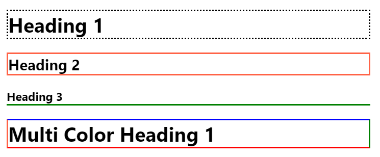

# CSS Basics - Day 2

Borders - you can have fun with borders. Below sample



## Borders

```html
<h1>Heading 1</h2>

<h2>Heading 2</h2>

<h3>Heading 3</h3>

<h1 id="multicolor">Multi Color Heading 1 </h3>

```

```css
<style>

    h1 { border-style: dotted;}

    h2 {
        border-style: solid;  
        border-color: tomato;
    }

    h3 { 
        border-bottom-style: solid; 
        border-color: green; 
    }

    #multicolor { 
        border-style: solid;
        border-bottom-color: red;
        border-right-color: green;
        border-top-color: blue ;
        border-left-color: tomato ;        
    }
</style>
```

## CSS Assignment #2

---

[Home Page](../README.md)

[Next: CSS Day 3 >>](03-css-day-03.md)
