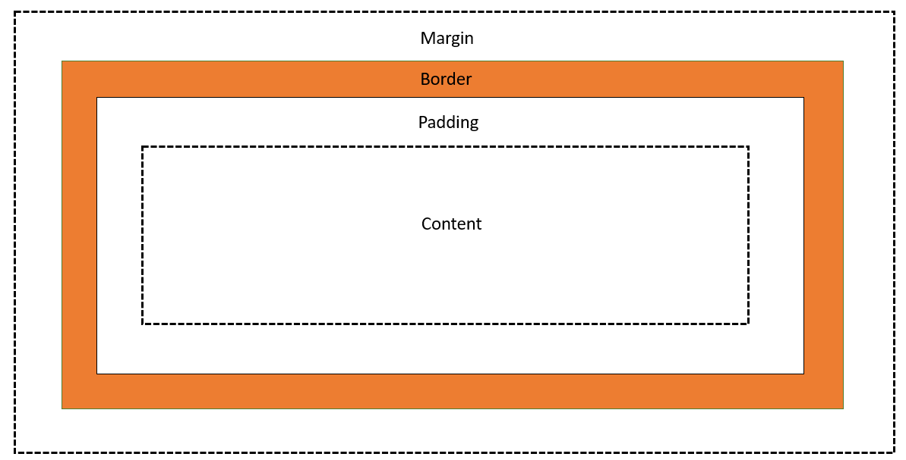

# CSS Basics - Day 5

## Box model

Every html tag occupies a rectangle space in browser. Hence we consider them as boxes. These boxes are by default placed on top of each other. Sometimes if we use `<br>` tag it would properly set as stacks of books. This basic priciple helps us understand how to place them. There are certain properties of box elements.



Notice the picture above for each html element we have these following properties. `margin`, `border`, `padding` and the actual content.

If we use these for a `<p>` tag it would look exactly the same.

```html
<div>
    <p>This is one paragraph</p>
</div>

<style>
    div {
        border: 1px solid green;
    }
    p {
        margin: 10px;
        border: 20px solid orange;
        padding: 10px;
        text-align: center;
    }
</style>
```

You can also mention the size for each side. The sequence is top, right, bottom and left. If you specify only one side then it would take that same size spacing for all the sides. 

```css
margin: 10px 20px 30px 40px; 
```

You can also make a box circular by specifying radius. 

```css
<div>
    <p></p>
</div>

<style>
    
    p {
        margin: 20%;
        border: 1px solid blue;
        border-radius: 50%;
        height: 200px;
        width: 200px;
    }
</style>
```


## CSS Assignment #5

- make rounded corder box with `<div>`
  
---

[Home Page](../README.md)

[Next: CSS Day 6 >>](06-css-day-06.md)
