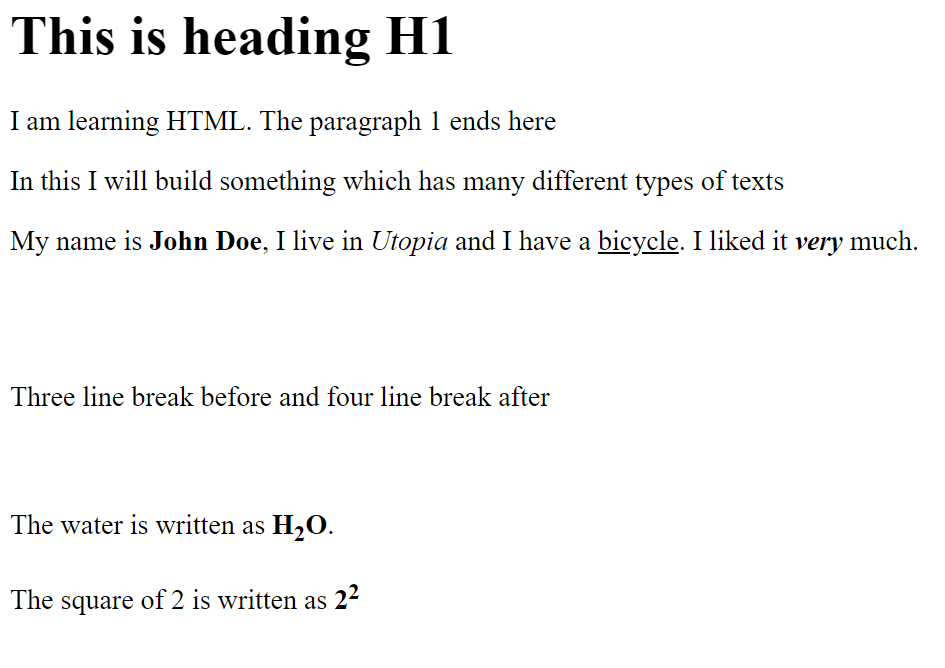

# HTML Basics - Day 1

## Tags

Tags has opening `<tagName>` and closing `</tagName>`

- Case insensitive `H1` and `h1` are same
- Never leave closing tag like `
`
- Empty tag ` ` can be used.
- Commenting `<!--...-->`

There are sevaral standard Tags,

| Tag |   Purpose |
|----|:----------|
| `<h1>..<h6>` | Heading 1 to 6 |
| `<h6>` | Heading 6 |
| `
` | horizontal line |
| `
` | Paragraph |
| `<pre>` | Pre formatted |
| ` ` | line break|
| `<b>` | bold text |
| `<i>` | italic text |
| `<u>` | underline text |
| `` | subscript |
| `` | superscript |

## Assignment #1

Open Notepad and save it with .html. After that Open it browser. Keep addind text to the Notepad and refresh your browser by right click or press F5.

Look at the below picture and build an HTML out of it,

We will discuss it in next class.

---

[Home Page](../README.md)

[Next: Day 2 >>](02-html-day-02.md)
