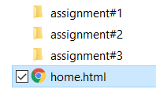

# HTML Basics - Day 5

Final structure and putting it all together.

## HTML File Structure

So far we have been skipping the complete HTML structures. Thanks to the modern browsers. They don't complain if we do not have the full HTML. It adds automatically the necessary tags. But we must know what makes HTML a complete,

```html
<!DOCTYPE html>
<html>    
    <head>
        <title>Sample Page</title>
        <style>
            /* here add the css */
        </style>
    </head>
    <body>
        <h1>The Header 1</h1>
        <p>Hello everyone</p>
        <br />
        The progress of the class is <progress value="38" max="100"></progress> 
        <br /><hr>
        <p><i>The design was done by Wriju</i></p>
    </body>
</html>
```

## Using more than one file

You should prevent creating one large html file. Rather should split into multiple files. Let's see how we nagivate between files and sections within a file (bookmark).

```html
<a href="students.html">Click to go to Student List</a>
```

## Attributes

Tags do come with attributes like `key="value"` inside a tag. They do help provide a lot of information.

```html
<a href="students.html">Click to go to Student List</a>
```

## HTML Assignment #5

- Since we have created few HTML files already. But we did not add the complete structure. So pickup any previous assignment and complete it with full structures.
- Put all the three assigment files and make a link from #1 to #2 to #3. You can keep all the three html files in the same folder.
- Do the above but keep the assignment files in different sub-folders like, 

     

---

[Home Page](../README.md)

[Next: CSS Day 1 >>](../css/01-css-day-01.md)
